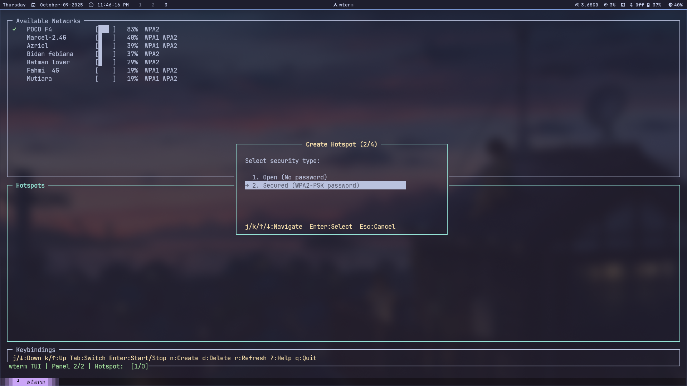

# wterm - TUI Network Manager

A lightweight Terminal UI (TUI) base network manager for linux written in C.

## Screenshot




## Features

- **Fast Network Scanning**: Native C implementation for quick WiFi network discovery
- **Pure C TUI**: termbox2-based interface with 3-panel layout (no external dependencies)
- **WiFi Hotspot Management**: Create and manage WiFi hotspots with automatic NAT configuration
- **Kernel-Level Verification**: Uses iw for reliable connection status detection
- **Memory Safe**: Comprehensive bounds checking and safe string operations
- **Well Tested**: Complete unit and integration test suite
- **Modern Build System**: CMake with professional project structure
- **Vim-Style Navigation**: j/k/h/l keys plus arrow keys for intuitive control
- **Modular Design**: Clean separation of concerns for easy maintenance
- **Auto NAT Setup**: Automatic internet sharing for hotspot clients

## Quick Start

### Option 1: Pre-built Binary (Fastest)

Download the latest release binary from [GitHub Releases](https://github.com/your-repo/wterm/releases):

```bash
# Download the binary (replace VERSION with actual version)
wget https://github.com/rizukirr/wterm/releases/download/vVERSION/wterm-x86_64-linux

# Install runtime dependencies based on your distro
# Arch Linux
sudo pacman -S networkmanager iw iptables iproute2

# Ubuntu/Debian
sudo apt update && sudo apt install network-manager iw iptables iproute2

# Fedora
sudo dnf install NetworkManager iw iptables iproute2

# openSUSE
sudo zypper install NetworkManager iw iptables iproute2

# Make executable and install
chmod +x wterm-x86_64-linux
sudo mv wterm-x86_64-linux /usr/local/bin/wterm

# Verify installation
wterm --version
```

**Requirements:**

- Linux x86_64 with glibc 2.31+ (most modern distros from 2020+)
- NetworkManager, iw, iptables, and iproute2 installed

### Option 2: Install Script from Source (Arch Linux Only)

> **⚠️ Note:** The install script is designed for **Arch Linux only** (uses pacman).
> For other distros (Ubuntu, Fedora, openSUSE), use Option 1 (pre-built binary) or Option 3 (manual build).

```bash
# Clone and install in one step (Arch Linux)
git clone https://github.com/rizukirr/wterm.git wterm
cd wterm
sudo ./scripts/install.sh
```

The install script automatically handles:

- Dependency installation (NetworkManager, iw, iptables, iproute2)
- Network manager conflict detection and switching
- Build and system installation

### Option 3: Manual Build from Source

```bash
# Build release version
./scripts/build.sh release

# Run the executable
./build/bin/wterm
```

## Prerequisites

### Build Dependencies

- **CMake** (>= 3.12)
- **GCC** or **Clang** compiler
- **Make** or **Ninja** build system

### Runtime Dependencies

- **NetworkManager** (`nmcli` command for WiFi management)
- **iw** (for kernel-level WiFi verification)
- **iptables** (for hotspot NAT configuration)
- **iproute2** (`ip` command for network routing)
- **Linux** system with glibc 2.31+ (works on most modern distros: Arch, Ubuntu 20.04+, Fedora, Debian, openSUSE)

### Auto-Installation

The install script can automatically install missing dependencies on Arch Linux:

```bash
sudo pacman -S base-devel cmake networkmanager iw iptables iproute2
```

## Build System

### Quick Build Commands

```bash
# Show all available options
./scripts/build.sh help

# Clean build with tests
./scripts/build.sh all

# Debug build with sanitizers
./scripts/build.sh debug --sanitize

# Release build
./scripts/build.sh release

# Run tests only
./scripts/build.sh test
```

### CMake Options

```bash
# Configure with options
mkdir build && cd build
cmake -DCMAKE_BUILD_TYPE=Release \
      -DBUILD_TESTS=ON \
      -DENABLE_SANITIZERS=OFF \
      ..

# Build
cmake --build . --parallel $(nproc)

# Run tests
ctest --output-on-failure
```

## Usage

### Interactive Mode (Default)

```bash
# Launch interactive TUI interface
wterm
```

**Interface Controls:**

- `j/k` or `↑↓` - Navigate networks
- `h/l` or `Tab` - Switch between panels
- `Enter` - Connect to selected network
- `r` - Rescan networks
- `d` - Disconnect from current network
- `c` - Create new hotspot
- `/` - Search/filter networks
- `q/Esc` - Quit

**3-Panel Layout:**

1. **Available Networks** - WiFi networks with signal strength and security
2. **Hotspots** - Configured hotspot profiles
3. **Keybindings** - Quick reference for controls

### Command Line Options

```bash
# Show help
wterm --help

# Show version information
wterm --version
```

### Network Connection

When you select a network:

- **Open networks**: Connect immediately
- **Secured networks**: Prompt for password securely
- **Connection status**: Real-time feedback with success/error messages

## Hotspot Management

wterm includes a NetworkManager-based hotspot management tool for creating and managing WiFi Access Points.

### Quick Hotspot Commands

```bash
# Create and start a secured hotspot
sudo ./scripts/hotspot_nm.sh create MyHotspot mypassword123

# Create an open hotspot
sudo ./scripts/hotspot_nm.sh create PublicWiFi --open

# Create with custom settings
sudo ./scripts/hotspot_nm.sh create MyHotspot password123 --band a --interface wlan0

# Manage hotspots
sudo ./scripts/hotspot_nm.sh start MyHotspot
sudo ./scripts/hotspot_nm.sh stop MyHotspot
sudo ./scripts/hotspot_nm.sh restart MyHotspot
sudo ./scripts/hotspot_nm.sh delete MyHotspot

# List and check status
sudo ./scripts/hotspot_nm.sh list
sudo ./scripts/hotspot_nm.sh status [MyHotspot]
```

### Hotspot Options

- `--interface <iface>` - WiFi interface (default: wlan0)
- `--band <bg|a>` - Frequency band: bg=2.4GHz, a=5GHz (default: bg)
- `--no-start` - Create configuration without starting
- `--open` - Create open hotspot (no password)
- `--gateway <ip/prefix>` - Gateway IP (default: 192.168.12.1/24)

### WiFi-to-WiFi Sharing Support

**NEW**: wterm now supports sharing WiFi connection via hotspot on compatible hardware!

**How It Works:**
- Detects hardware support for concurrent mode (client + AP simultaneously)
- Creates a virtual WiFi interface (e.g., `vwlan0`) for the hotspot
- Physical interface stays connected to WiFi network
- Both interfaces operate on the same channel (hardware requirement)
- Traffic flows: Hotspot clients → Virtual interface → NAT → Physical WiFi → Internet

**Requirements:**
- WiFi adapter that supports concurrent mode (most modern adapters)
- Linux kernel with `iw` support
- Both interfaces must use the same WiFi channel

**Automatic Behavior:**
- Enabled by default via `use_virtual_if_possible` config flag
- Automatically detects if your WiFi adapter supports concurrent mode
- Automatically uses same channel as active WiFi connection
- Falls back to traditional mode if concurrent mode unavailable
- Virtual interfaces automatically cleaned up when hotspot stops

**Hardware Compatibility:**
- **Most modern WiFi adapters** support concurrent mode (check with: `iw phy phy0 info`)
- Adapters with "valid interface combinations" showing both managed and AP modes
- Common chipsets: Intel WiFi 6/6E, Qualcomm Atheros, MediaTek, Realtek (most recent models)

**Fallback Behavior:**
- If concurrent mode is not supported, wterm automatically disconnects WiFi before starting hotspot
- No user intervention required - transparent fallback to traditional mode

**Other Notes:**
- Requires root/sudo privileges
- Hotspot configurations are persistent across reboots
- Virtual interface names: `vwlan0`, `vwlan1`, etc.

## Testing

### Run All Tests

```bash
./scripts/build.sh test
```

### Individual Test Suites

```bash
# String utilities tests
./build/tests/test_string_utils

# Network scanner tests
./build/tests/test_network_scanner

# Integration tests (includes original bug verification)
./build/tests/test_integration
```

### Test Coverage

The integration tests specifically verify that the original "POCO F4" bug is fixed and that all network types from the original problematic output now parse correctly.

## Development

### Code Style

- **C99 standard** compliance
- **Consistent naming**: snake_case for functions, ALL_CAPS for constants
- **Memory safety**: All string operations use bounds checking
- **Error handling**: Proper return codes and validation
- **Documentation**: Doxygen-style comments for public APIs

### Adding Features

1. Add new functions to appropriate modules (`src/core/` or `src/utils/`)
2. Update corresponding header files
3. Add unit tests in `tests/`
4. Update CMakeLists.txt if needed
5. Run `./scripts/build.sh all` to verify

### Memory Safety

This codebase prioritizes memory safety:

- No `malloc/free` - uses stack allocation
- All `strncpy` operations include bounds checking
- Input validation on all public functions
- Sanitizer support for development builds

## Installation

### System-wide Installation

```bash
# Using install script (Arch Linux only)
sudo ./scripts/install.sh

# Manual installation after build (all distros)
sudo cmake --install build/
```

**Note:** The install script only works on Arch Linux. For other distributions, use manual installation or the pre-built binary.

### Package Creation

```bash
# Create distributable package
./scripts/build.sh package

# Packages will be in build/ directory
ls build/*.tar.gz build/*.deb
```

## Comparison with v1

| Feature               | v1 (Shell)                  | v3 (C + TUI)                       |
| --------------------- | --------------------------- | ---------------------------------- |
| **Performance**       | Slower (multiple processes) | Fast (single binary)               |
| **User Interface**    | Basic text output           | termbox2 TUI (3-panel)             |
| **Network Selection** | Manual SSID typing          | Interactive TUI navigation         |
| **Hotspot Support**   | No                          | Full with NAT auto-config          |
| **Memory Safety**     | Shell-safe                  | Explicit bounds checking           |
| **Dependencies**      | `iwd`, `fzf`, `bash`        | `NetworkManager`, `iw`, `iptables` |
| **Testing**           | Manual                      | Comprehensive test suite           |
| **Build System**      | None                        | Professional CMake                 |
| **Bug Handling**      | Open network bug present    | Open network bug fixed             |
| **Maintainability**   | Script-based                | Modular C architecture             |

## Contributing

1. Fork the repository
2. Create a feature branch
3. Add tests for new functionality
4. Ensure all tests pass: `./scripts/build.sh all`
5. Submit a pull request

## License

This project is open source. Feel free to use, modify, and distribute.

## Acknowledgments

- Original wterm shell implementation for inspiration
- NetworkManager project for the reliable `nmcli` interface
- The bug report that led to this complete rewrite and improvement
